# CI/CD Pipeline with Jenkins, SonarQube, Trivy, Docker & Flask

> End-to-End DevOps Project Demonstrating Continuous Integration, Security Scanning, Containerization, Image Publishing, and Automated Deployment using Industry-Standard Tools.

---

## ====================================
## ★ PROJECT OVERVIEW
## ====================================

This project demonstrates the implementation of a complete CI/CD (Continuous Integration and Continuous Deployment) pipeline using Jenkins, GitHub, Docker, SonarQube, Trivy, and Flask.

The primary objective of this project is to automate the software delivery lifecycle by integrating source code management, security validation, vulnerability scanning, containerization, image publishing, and deployment operations into a single automated workflow.

The project simulates a real-world DevOps environment where application code is continuously validated, analyzed, scanned, packaged, and deployed using modern DevOps practices and tools.

Throughout the implementation process, multiple real-world challenges were encountered and resolved, including DNS configuration issues, Git branch mismatches, Jenkins pipeline execution errors, Docker integration challenges, and repository checkout conflicts.

This project helped develop hands-on experience with DevOps workflows, CI/CD automation, Linux administration, security scanning, containerization, troubleshooting, and deployment processes.

---

## =====================================
## ★ PROJECT OBJECTIVES

## =====================================
The main objectives of this project were:

- Implement a complete CI/CD pipeline using Jenkins
- Integrate GitHub with Jenkins for automated source code retrieval
- Create and deploy a Flask-based web application
- Containerize the application using Docker
- Perform security scanning using Trivy
- Integrate code quality tools such as SonarQube
- Publish Docker images to Docker Hub
- Simulate production-style deployment workflows
- Learn DevOps automation practices
- Gain hands-on experience with Linux-based environments
- Understand vulnerability assessment and image scanning
- Troubleshoot real-world DevOps implementation issues

---

## =====================================================================
## ★ TECHNOLOGY STACK
## =====================================================================

### DevOps Tools

- Jenkins
- Git
- GitHub
- Docker
- Docker Hub
- SonarQube
- Trivy

### Programming Languages

- Python 3
- Groovy (Jenkins Pipeline)

### Framework

- Flask

### Operating System

- Ubuntu Linux

### Virtualization Platform

- Oracle VirtualBox

### Security Tools

- SonarQube
- Trivy

### Version Control

- Git
- GitHub

### Containerization

- Docker

---

## =====================================================================
## ★ PROJECT ARCHITECTURE
## =====================================================================

```text
Developer
    │
    ▼
GitHub Repository
    │
    ▼
Jenkins Pipeline
    │
    ├──────────────► SonarQube Analysis
    │
    ├──────────────► Trivy File System Scan
    │
    ▼
Docker Build
    │
    ▼
Trivy Image Scan
    │
    ▼
Docker Hub
    │
    ▼
Container Deployment
    │
    ▼
Flask Application
```

---

## =====================================================================
## ★ PROJECT STRUCTURE
## =====================================================================

```text
flask-cicd-project/
│
├── app.py
├── requirements.txt
├── Dockerfile
├── Jenkinsfile
├── README.md
│
├── 01-Jenkins-Dashboard.png
├── 02-SonarQube-Login.png
├── 03-SonarQube-Dashboard.png
├── 04-SonarQube-Token-Created.png
├── 05-SonarQube-Scanner-Plugin-Installation.png
├── 06-Jenkins-System-Configuration.png
├── 08-First-Successful-Jenkins-Build.png
├── 09-Jenkins-Console-Output-Success.png
├── 10-Trivy-Installation-Verified.png
├── 11-Trivy-FileSystem-Scan.png
├── 11-Trivy-Security-Scan-Results.png
├── 12-Trivy-Vulnerability-Demo.png
├── 13-Docker-Image-Build-Success.png
├── 14-Docker-Image-Listed.png
├── 15-DockerHub-Push-Success.png
│
└── README.md
```

---

## =====================================================================
## ★ APPLICATION FEATURES
## =====================================================================

The application is developed using Flask and provides multiple endpoints that simulate a production-ready application.

### Home Endpoint

```http
GET /
```

Returns application status information.

Example Response:

```json
{
  "message": "CI/CD Pipeline Working Successfully",
  "status": "healthy",
  "application": "Flask CI/CD Demo"
}
```

### Health Check Endpoint

```http
GET /health
```

Returns health information and timestamp.

Example Response:

```json
{
  "status": "UP",
  "timestamp": "2025-06-04"
}
```

### System Information Endpoint

```http
GET /system
```

Returns:

- Hostname
- Platform Information
- Python Version

Example Response:

```json
{
  "hostname": "container-host",
  "platform": "Linux",
  "python_version": "3.9"
}
```

### Version Endpoint

```http
GET /version
```

Returns application version information.

Example Response:

```json
{
  "application": "Flask CI/CD Demo",
  "version": "1.0.0"
}
```

### Environment Endpoint

```http
GET /env
```

Returns environment information.

Example Response:

```json
{
  "environment": "development"
}
```

---

## =====================================================================
## ★ DOCKER IMPLEMENTATION
## =====================================================================

The application was containerized using Docker to ensure portability, consistency, and ease of deployment.

### Dockerfile

```dockerfile
FROM python:3.9-slim

WORKDIR /app

COPY requirements.txt .

RUN pip install -r requirements.txt

COPY . .

EXPOSE 5000

CMD ["python", "app.py"]
```

### Docker Features Implemented

- Docker image creation
- Docker image tagging
- Docker Hub integration
- Container deployment
- Container lifecycle management
- Image publishing
- Environment portability

### Docker Image

```text
anikaaa/devops-project:v1
```

---

## =====================================================================
## ★ JENKINS PIPELINE IMPLEMENTATION
## =====================================================================

The Jenkins pipeline was created to automate multiple stages of the software delivery lifecycle.

### Pipeline Stages

| Stage | Purpose |
|---------|---------|
| Clone Repository | Retrieve source code from GitHub |
| Trivy FS Scan | Scan project files |
| Build Docker Image | Create Docker image |
| Trivy Image Scan | Scan Docker image |
| Push to Docker Hub | Publish image |
| Deploy Container | Deploy application |

### Jenkins Features Implemented

- Pipeline as Code
- GitHub Integration
- Automated Builds
- Security Validation
- Docker Automation
- Deployment Automation
- Credential Management

---

## =====================================================================
## ★ TRIVY SECURITY IMPLEMENTATION
## =====================================================================

Trivy was used to perform vulnerability scanning and security assessment.

### Security Scans Performed

- File System Scanning
- Dependency Scanning
- Vulnerability Detection
- Docker Image Scanning

### Commands Used

```bash
trivy --version
```

```bash
trivy fs .
```

```bash
trivy fs --severity HIGH,CRITICAL .
```

```bash
trivy image IMAGE_NAME
```

### Benefits

- Early vulnerability detection
- Secure development practices
- Improved application security
- Dependency validation

---

## =====================================================================
## ★ SONARQUBE INTEGRATION
## =====================================================================

SonarQube was configured and integrated with Jenkins for code quality analysis.

### SonarQube Features

- Static Code Analysis
- Security Hotspot Detection
- Code Smell Detection
- Maintainability Analysis
- Reliability Analysis
- Quality Gate Validation

### Integration Process

1. Installed SonarQube
2. Generated Authentication Token
3. Installed SonarQube Scanner Plugin
4. Configured Jenkins Integration
5. Connected Jenkins to SonarQube Server

---

## =====================================================================
## ★ CI/CD WORKFLOW
## =====================================================================

### Step 1 – Development

Application code is developed using VS Code.

### Step 2 – Source Control

Source code is pushed to GitHub.

### Step 3 – Jenkins Trigger

Jenkins retrieves the source code.

### Step 4 – Security Validation

Trivy performs vulnerability scanning.

### Step 5 – Docker Build

Docker creates an image.

### Step 6 – Image Security Scan

Docker image is scanned.

### Step 7 – Image Publishing

Image is pushed to Docker Hub.

### Step 8 – Deployment

Container is deployed.

---

## =====================================================================
## ★ SCREENSHOTS & PROJECT EVIDENCE
## =====================================================================

### Jenkins Dashboard

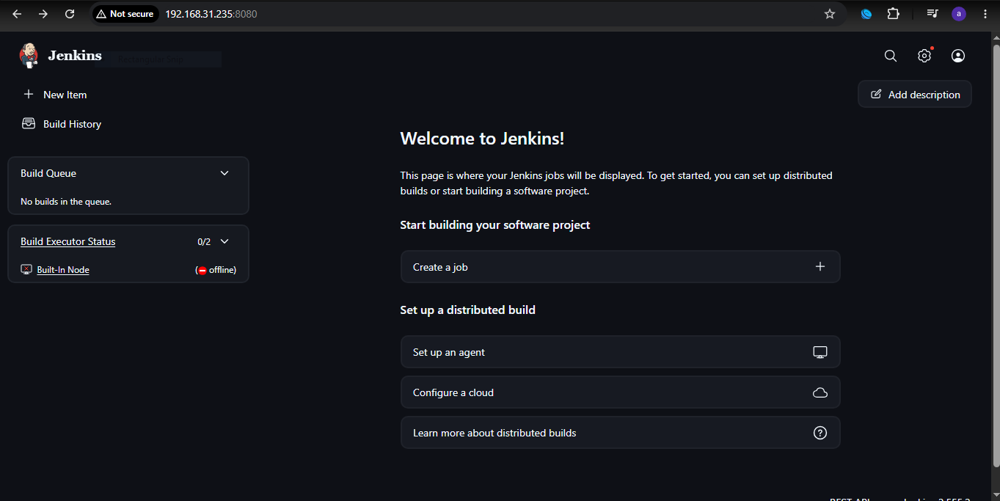

**Purpose:**

- Verifies successful Jenkins installation
- Shows Jenkins dashboard access
- Confirms Jenkins server availability

---

### SonarQube Login

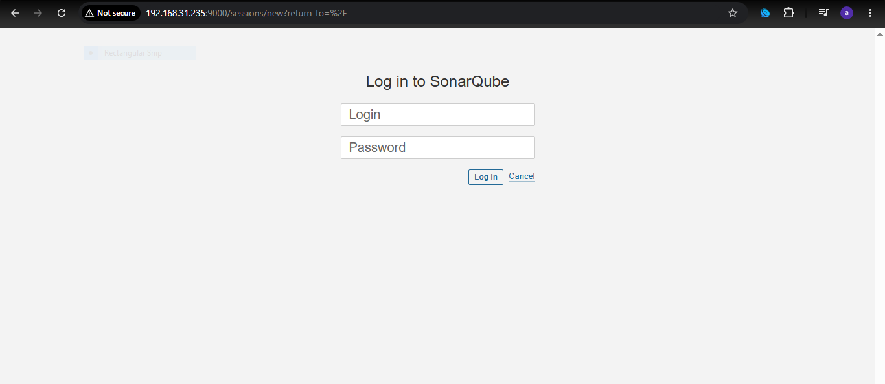

**Purpose:**

- Verifies SonarQube installation
- Confirms SonarQube accessibility

---

### SonarQube Dashboard

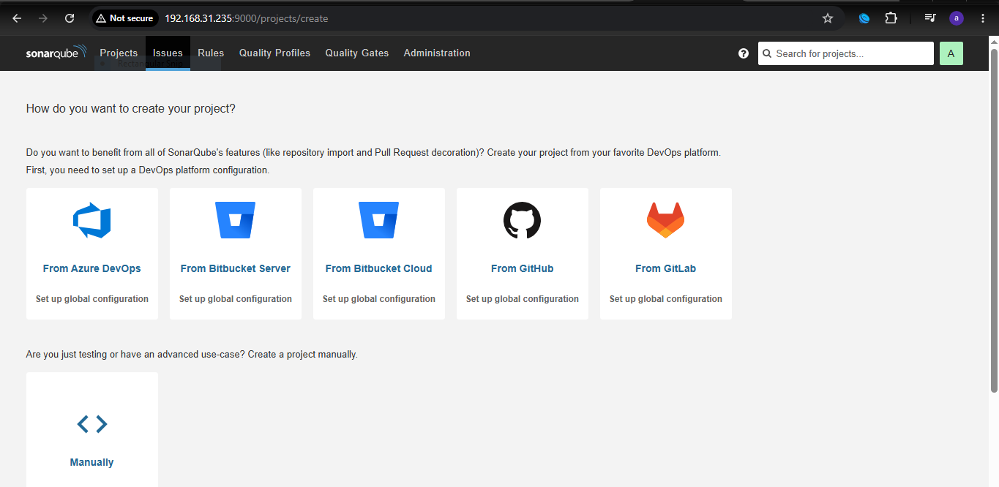

**Purpose:**

- Shows successful SonarQube deployment
- Displays SonarQube interface

---

### SonarQube Token Creation

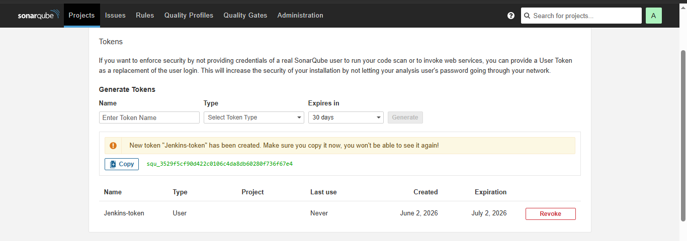

**Purpose:**

- Shows authentication token creation
- Used for Jenkins integration

---

### SonarQube Scanner Plugin Installation

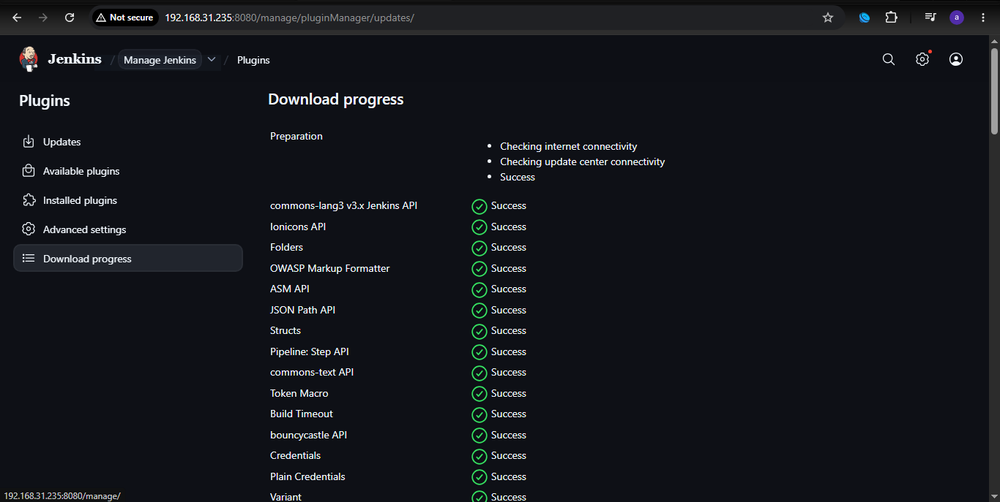

**Purpose:**

- Demonstrates plugin installation
- Enables SonarQube integration

---

### Jenkins System Configuration

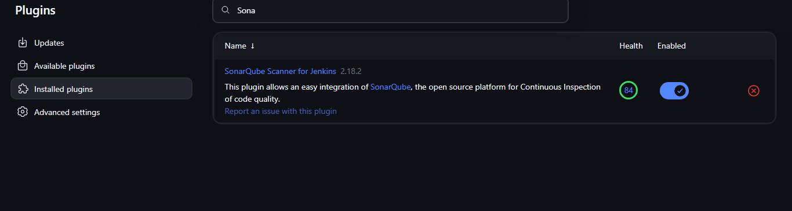

**Purpose:**

- Shows Jenkins global configuration
- Demonstrates SonarQube setup

---

### First Successful Jenkins Build

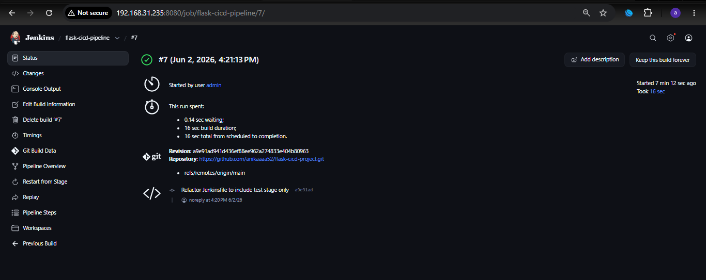

**Purpose:**

- Confirms successful pipeline execution
- Demonstrates GitHub integration

---

### Jenkins Console Output

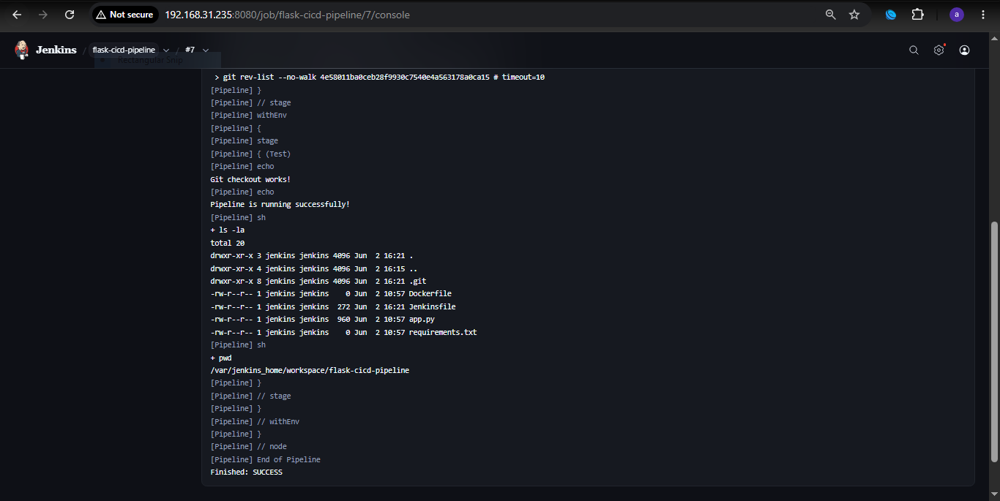

**Purpose:**

- Displays successful build logs
- Verifies pipeline execution

---

### Trivy Installation Verification

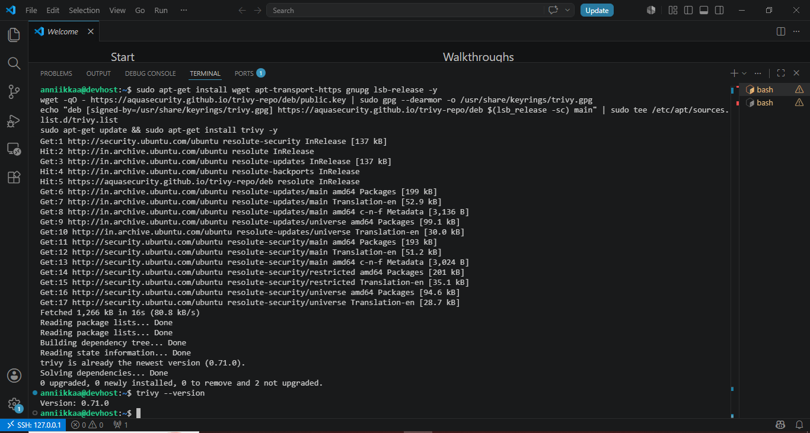

**Purpose:**

- Confirms successful Trivy installation

---

### Trivy File System Scan

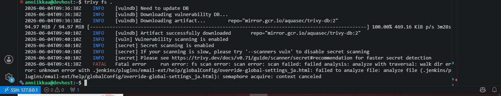

**Purpose:**

- Demonstrates vulnerability scanning
- Shows security validation process

---

### Trivy Security Scan Results

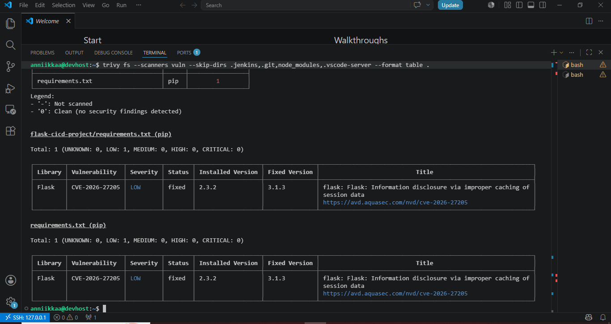

**Purpose:**

- Displays scan findings
- Demonstrates vulnerability assessment

---

### Trivy Vulnerability Demonstration

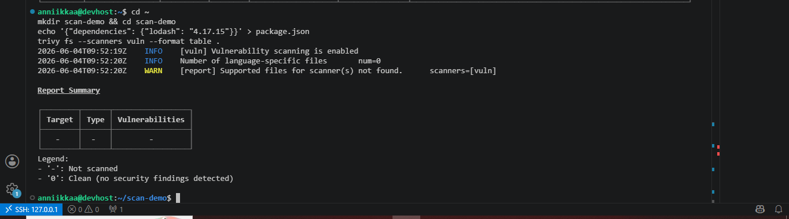

**Purpose:**

- Demonstrates vulnerability detection capability
- Shows Trivy identifying vulnerable dependencies

---

### Docker Build Success

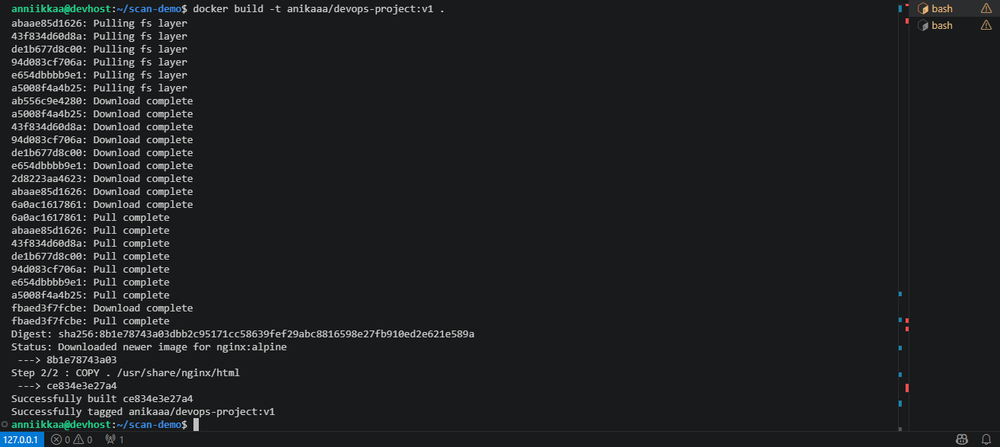

**Purpose:**

- Confirms successful Docker image creation
- Verifies containerization process

---

### Docker Image Listing

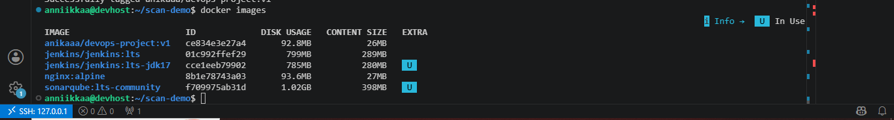

**Purpose:**

- Shows locally available Docker images
- Verifies successful image creation

---

### Docker Hub Push Success

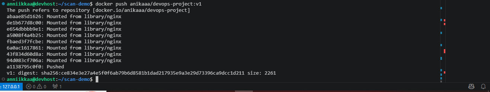

**Purpose:**

- Confirms successful image publishing
- Demonstrates Docker Hub integration

---

## =====================================================================
## ★ CHALLENGES FACED & TROUBLESHOOTING
## =====================================================================

### DNS Resolution Failure

**Issue**

```text
Could not resolve host: github.com
```

**Resolution**

- Configured DNS manually
- Verified internet connectivity

### Branch Configuration Issue

**Issue**

```text
Couldn't find any revision to build
```

**Resolution**

- Updated branch configuration from master to main

### Duplicate Checkout Issue

**Issue**

- Repository checked out multiple times

**Resolution**

- Removed redundant checkout stage

### Docker & Tool Accessibility Issues

**Issue**

- Docker and Trivy not initially accessible

**Resolution**

- Verified installation paths
- Updated configuration

---

## =====================================================================
## ★ SKILLS DEMONSTRATED
## =====================================================================

### DevOps

- Continuous Integration
- Continuous Deployment
- CI/CD Pipeline Design
- Build Automation
- Pipeline Management

### Security

- Vulnerability Assessment
- Security Scanning
- DevSecOps Practices
- Static Code Analysis

### Containers

- Docker
- Docker Hub
- Container Deployment
- Image Management

### Linux

- Ubuntu Administration
- Package Management
- Troubleshooting
- Shell Commands

### Version Control

- Git
- GitHub
- Branch Management

---

## =====================================================================
## ★ FUTURE ENHANCEMENTS
## =====================================================================

- Complete SonarQube Pipeline Automation
- Kubernetes Deployment
- Jenkins Webhooks
- AWS Deployment
- Prometheus Monitoring
- Grafana Dashboards
- Terraform Infrastructure Automation
- Multi-Container Docker Compose Environment

---

## =====================================================================
## ★ AUTHOR
## =====================================================================

**Anika Khan**

Cloud & DevOps Enthusiast

### Core Skills

- Jenkins
- Docker
- GitHub
- SonarQube
- Trivy
- Python
- Flask
- Linux
- DevOps
- CI/CD

---

## =====================================================================
## ★ KEY LEARNING OUTCOMES
## =====================================================================

Through this project, I gained practical experience with:

- CI/CD Pipeline Design
- Jenkins Administration
- Docker Image Management
- Security Scanning
- SonarQube Configuration
- GitHub Integration
- Linux Troubleshooting
- Container Deployment
- DevOps Best Practices
- Real-World Pipeline Debugging

---

### ★ If you found this project interesting, feel free to explore the repository and review the screenshots demonstrating each implementation phase.
